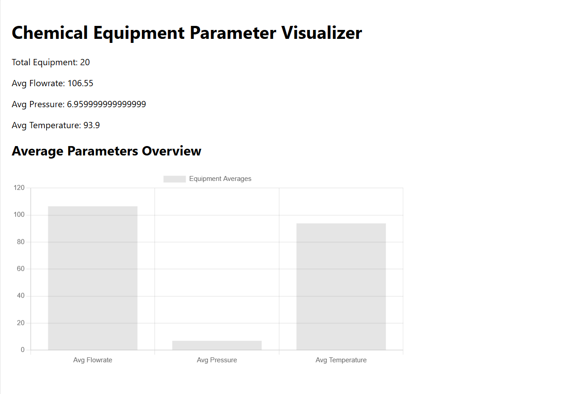
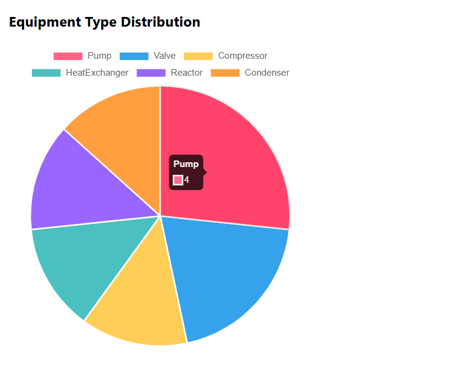
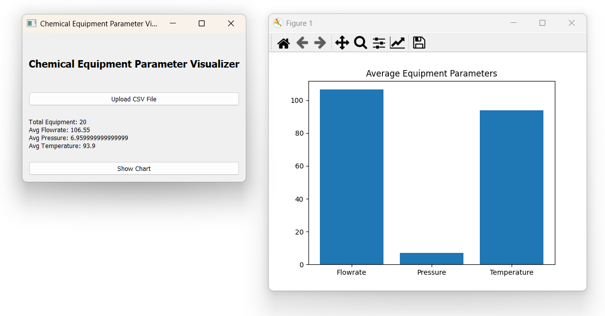
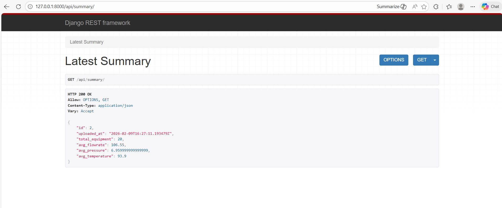

# Chemical Equipment Parameter Visualizer
### (Hybrid Web + Desktop Application)

---

## Project Overview

This project is a hybrid **Web + Desktop application** developed as part of the  
**FOSSEE IIT Bombay Internship Screening Task**.

The application allows users to upload a CSV file containing chemical equipment parameters.  
A common **Django REST backend** processes the data, performs analytics using **Pandas**, and serves results to:

- A **Web frontend** built with **React** and **Chart.js**
- A **Desktop application** built with **PyQt5** and **Matplotlib**

Both frontends consume the same backend APIs, demonstrating proper **full-stack** and **API-based architecture**.

---

## Sample CSV Parameters

Each CSV file contains the following columns:

- Equipment Name  
- Equipment Type  
- Flowrate  
- Pressure  
- Temperature  

A sample CSV file (`sample_equipment_data.csv`) is included for testing.

---

## Tech Stack

### Backend
- Python  
- Django  
- Django REST Framework  
- Pandas  
- SQLite  

### Web Frontend
- React.js  
- Axios  
- Chart.js  
- react-chartjs-2  

### Desktop Frontend
- PyQt5  
- Matplotlib  
- Requests  

---

## Features Implemented

### Backend
- CSV upload API  
- Data parsing and analytics using Pandas  
- Summary statistics:
  - Total equipment count  
  - Average flowrate  
  - Average pressure  
  - Average temperature  
- Upload history storage (last 5 uploads)  
- Single backend shared by both frontends  

### Web Application
- CSV upload via browser  
- Display of summary statistics  
- Bar chart visualization of average parameters  
- Clean and responsive UI  

### Desktop Application
- Native desktop window (PyQt5)  
- CSV file upload using file dialog  
- Display of summary statistics  
- Matplotlib bar chart visualization  

---

## Project Architecture

chemical-equipment-visualizer
│
├── backend/ Django REST backend
├── web-frontend/ React web application
├── desktop-frontend/ PyQt5 desktop application
├── screenshots/ Screenshots of the output
├── sample_equipment_data.csv
└── README.md

Both the web and desktop applications communicate with the same Django backend APIs.

---

## Setup Instructions

### Backend Setup (Django)

#### - Navigate to the backend directory:
cd backend

#### - Create and activate virtual environment:
python -m venv venv
venv\Scripts\activate

#### - Install dependencies:
pip install -r requirements.txt

#### - Apply migrations:
python manage.py migrate

#### - Start the server:
python manage.py runserver

#### - Backend runs at:
http://127.0.0.1:8000

---

### Web Frontend Setup (React)

#### - Navigate to web frontend:
cd web-frontend

#### - Install dependencies:
npm install

#### - Start development server:
npm start

#### - Web app runs at:
http://localhost:3000

---

### Desktop Application Setup (PyQt5)

Ensure Django backend is running.

#### - Navigate to desktop frontend:
cd desktop-frontend

#### - Install dependencies:
pip install pyqt5 matplotlib requests

#### - Run the application:
python app.py

A desktop window will open allowing CSV upload and chart visualization.

--- 

### Demo Flow

1. Start the Django backend
2. Run either the Web application or the Desktop application
3. Upload the provided sample CSV file
4. View summary statistics
5. Observe data visualization chart

---

### Screenshots

### Web Application – Summary & Visualization 

### Desktop Application – Native UI & Chart 
 

### Backend API – Summary Response 

---

### Notes for Evaluators

A single backend is shared between both web and desktop applications
APIs are reused without duplication of logic
The project focuses on clarity, correctness, and adherence to the given task
The implementation is intentionally clean and minimal to ensure stability and ease of understanding

---

## Author

**Yogesh N**  
Sri Sairam Engineering College  
Computer Science Engineering (AI/ML)  
FOSSEE Internship Applicant
